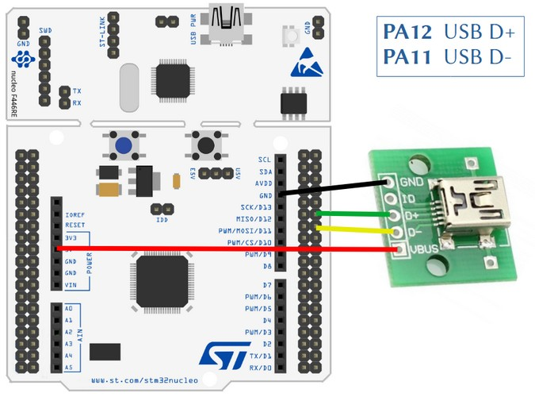
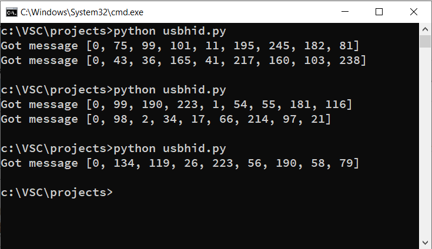
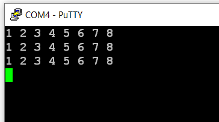

# USB HID demo
## project name: mbed6_usbHID_demo
Tested by: **Keil Studio** 1.50 and **Mbed-OS** 6.16.0

USBHID example from the Mbed Os documentation

**Reference:** [https://os.mbed.com/docs/mbed-os/v6.15/apis/usbhid.html](https://os.mbed.com/docs/mbed-os/v6.15/apis/usbhid.html) 
 
The program simply sends reports of 8 random bytes and accepts 8 byte
messages from the PC as well. After each package received the state 
of the builtin LED is toggled.

## Notes:
1. The first parameter of the constructor of the USBHID class should 
be a  **true** value (note that the order of parameter was different 
in earlier Mbed OS versions)


2. This program requires an application on the PC side as well.
Please, find the USBHID.py Python example application  at the link above 
the (the pywinusb Python module should be installaed as well)

## Hardware requirements
* NUCLEO-F446RE development board
* USB conncetor breakout for the STM32F446RE USBFS channel
* USB connection to a PC through the built-in ST-Link v2-1

## Wiring instructions for the NUCLEO-F446RE board

There is no USB connector for the USBFS channel of the target CPU therefore we have to prepare connection
by using an USB cable and an USB socket breakout card.

| USB breakout  | NUCLEO-F446RE pin   |
|:-------:|:-----: |
|  GND    |GND     | 
|  ID     | --     | 
|  D+     | PA_12  |
|  D-     | PA_11  | 
|  VBUS   | 5V     | 





## Software requirements
* Start with an empty mbed 6 project
* Edit the main.cpp source file
* Configure the project by adding an **mbed_app.json** file in which
    * We have to configure **usb_speed** parameter
    * We have to add **USBDEVICE** to the device list of the target

Finally the **mbed_app.json** sholuld look like this: 

```
{
    "config": {
        "usb_speed": {
            "help": "USE_USB_OTG_FS or USE_USB_OTG_HS or USE_USB_HS_IN_FS",
            "value": "USE_USB_OTG_FS"
        }
    },
    "target_overrides": {
        "*": {
            "target.device_has_add": ["USBDEVICE"]
        }
    }
}
```
## mbed6_usbHID_demo results
Open a terminal window for the serial port of the target MCU through 
the ST-Link v2-1. The default baudrate is 9600 bps. 
Open a Command shell (CMD) and run the Pathyon script below
(besides Python, also the pywinusb extrension should be installed).

The script will open the first USB HID device which have 
a vendor name containing the word: **mbed**
Then sends a fix message of 8 data bytes while accepts one or 
more incoming reports containing random numbers.

```python
from pywinusb import hid

# Whenever the host computer receives data from the
# Mbed board, the received data is printed
def on_data(data):
    print(f"Got message {data}")

'''
Gets all HIDs currently connected to host computer,
and sets the first device with string "mbed" in its
vendor name equal to variable mbed. This variable
will be used to send data to the Mbed board.
'''
all_hid_devices = hid.find_all_hid_devices()

mbed_devices = [d for d in all_hid_devices if "mbed" in d.vendor_name]

if mbed_devices is None:
    raise ValueError("No HID devices found")

# A buffer of bytes representing the values 1-8
# The first byte is the report ID which must be 0
buffer = [0, 1, 2, 3, 4, 5, 6, 7, 8]

mbed_devices[0].open()
# Set custom raw data handler
mbed_devices[0].set_raw_data_handler(on_data)

# Send the message to the Mbed board
out_report = mbed_devices[0].find_output_reports()
out_report[0].set_raw_data(buffer)
out_report[0].send()
mbed_devices[0].close()
```

The first byte of the reports incoming from the mbed board
is the report ID (always zero). In the figure below we run
the script three times.



The packges arriving from the PC are simply printed out 
on the console.



